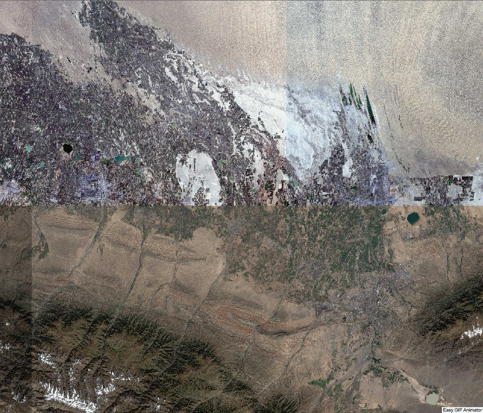
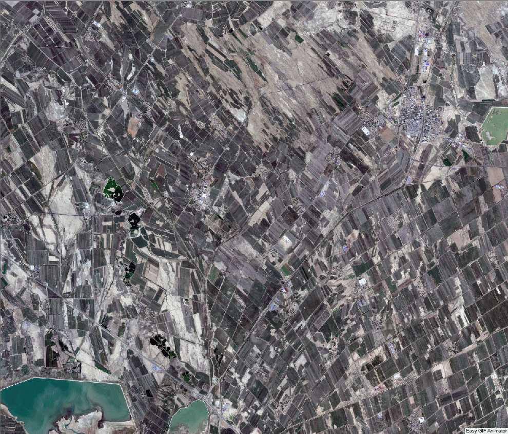
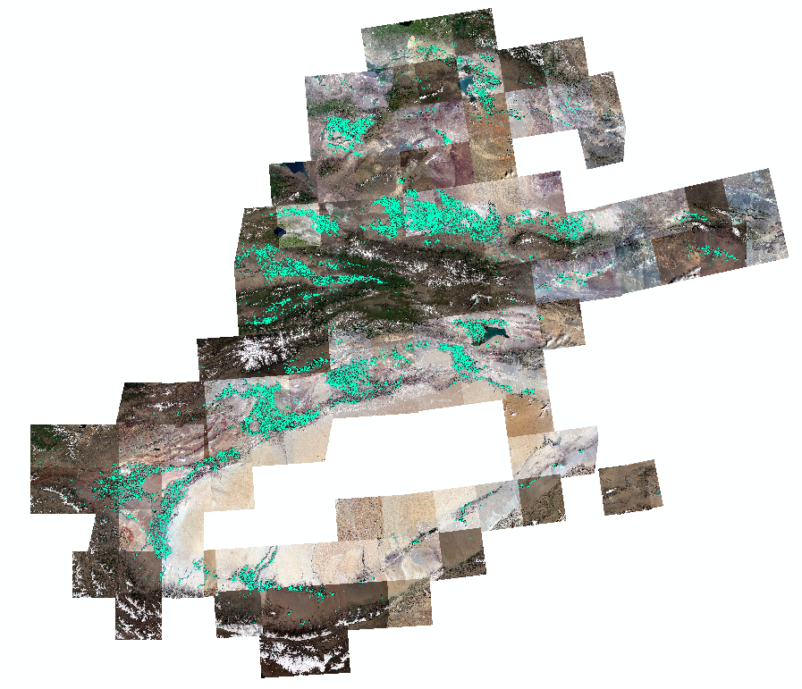
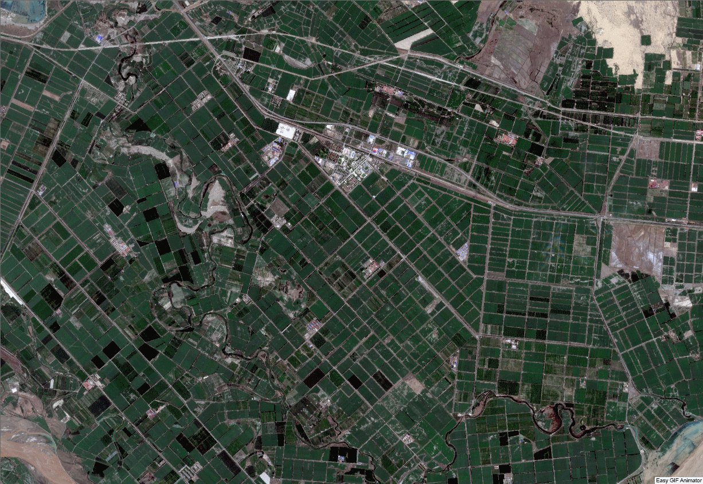
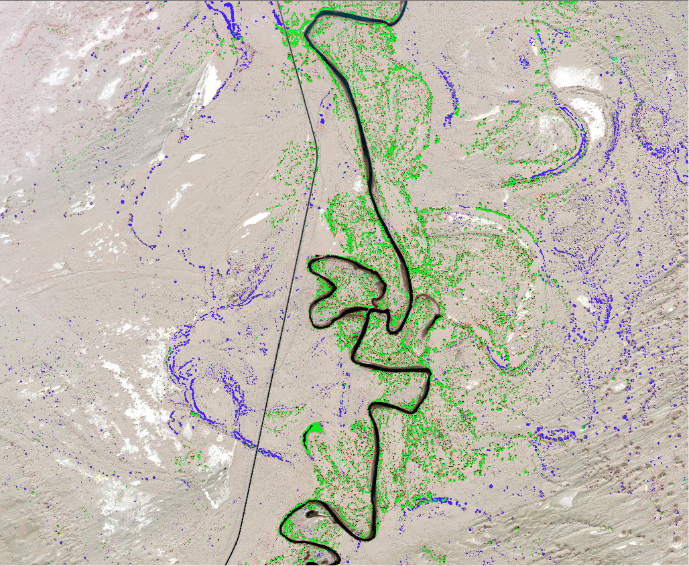
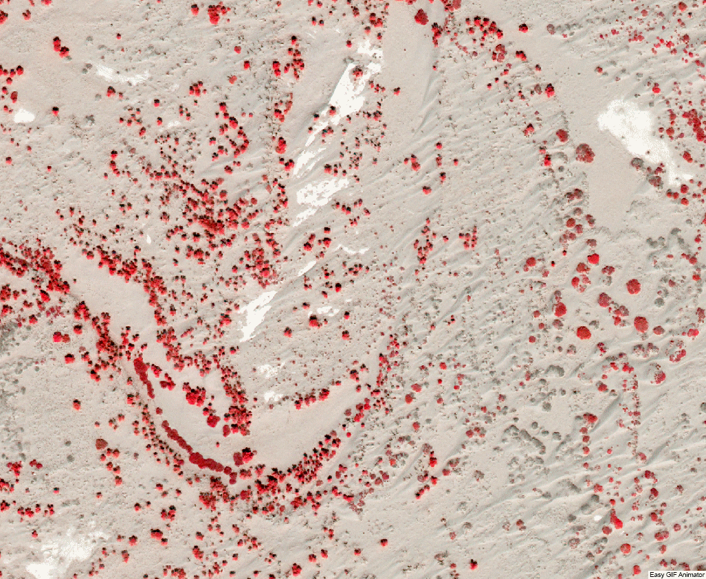

# AGRS_semantic_segmentation

## 0.简介
AGRS_semantic_segmentation是一个面向遥感制图工程的语义分割项目。 

主要特性

- **面向遥感制图工程应用**

  与计算机视觉经典图像相比，遥感影像存在带有地理坐标、大尺度、多波段等特点。本项目基于遥感影像特点及遥感制图工程需求，针对性地设计改进，已在多个不同遥感制图实践中验证通过。

- **模块化设计**
  
  本项目代码采取模块化设计，代码清晰简洁，可维护性及可拓展性良好。

- **集成多种语义分割模型**

  本项目集成多种经典的CNN-based以及Transformer-based模型，*e.g.* UNet, DeepLabV3+, DLinkNet, Segformer etc. 

- **配套的样本制作项目**

  本项目有配套的遥感影像样本制作项目[AGRS_sample_production](https://github.com/spAurora/AGRS_sample_production "https://github.com/spAurora/AGRS_sample_production")

## 1. 部分结果展示
### 1.1 玛纳斯流域多要素分类`(Sentinel-2 10m 4波段)`
利用多个CNN-based语义分割模型提取了玛纳斯流域（约13万平方公里）的耕地、林地、冰川、建筑、水体、沙漠。  

[原始影像下载链接(百度网盘)](https://pan.baidu.com/s/1Pdm_mmMqskV4VxpuVOumgg)
提取码：zodr 
[矢量结果下载链接(百度网盘)](https://pan.baidu.com/s/1KyNjj8fd2pjWo6NxU5dWKQ) 
提取码：ilvj  

**概览** 
  
**局部** 
  

### 1.2 2021年7月新疆农作物种植分布`(Sentinel-2 10m 4波段)`
全疆大尺度遥感工程应用实践 
**概览** 
  
**局部** 
  

### 1.3 塔里木河流域胡杨与红柳提取`(WV-2 2m 8波段)`
在超高空间分辨率多光谱影像上提取并识别极易混淆的红柳与胡杨 
**概览** 
  
**局部** 
  
