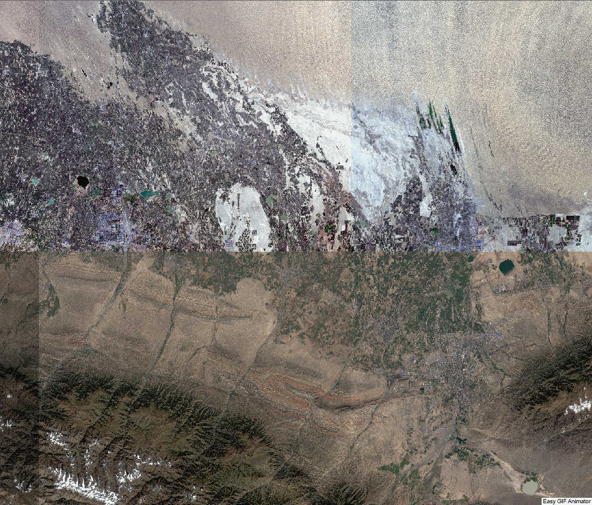

# AGRS_semantic_segmentation

## 0.引入
AGRS_semantic_segmentation是一个面向'遥感制图工程'的语义分割项目，作者结合过去一年的语义分割遥感制图经验，于2022年5月起逐渐形成了该项目，目前仍在持续更新中:star:。 

感谢SZF老师、LJC老师、LJL老师课题组各位同学的通力合作 

环境依赖（仅列举部分关键）
    Python>=3.6
    Pytorch>=1.7.0
    Gdal=2.4.1

主要特性

- **面向遥感制图工程应用**

  与计算机视觉经典图像相比，遥感影像存在带有地理坐标、大尺度、多波段等特点。本项目基于遥感影像特点及遥感制图工程需求，针对性地设计改进，已在多个不同遥感制图实践中验证通过。

- **模块化设计**
  
  本项目代码采取模块化设计，代码清晰简洁，可维护性及可拓展性良好。

- **集成多种语义分割模型**

  本项目集成多种经典的CNN-based以及Transformer-based模型，*e.g.* UNet, DeepLabV3+, DLinkNet, Segformer etc. 

- **配套的样本制作项目**

  本项目有配套的遥感影像样本制作项目[AGRS_sample_production](https://github.com/spAurora/AGRS_sample_production "https://github.com/spAurora/AGRS_sample_production")

## 1. 部分结果展示
### 1.1 玛纳斯流域多要素分类
Sentinel-2 4波段 
  

